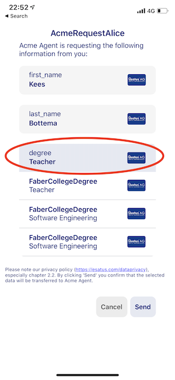
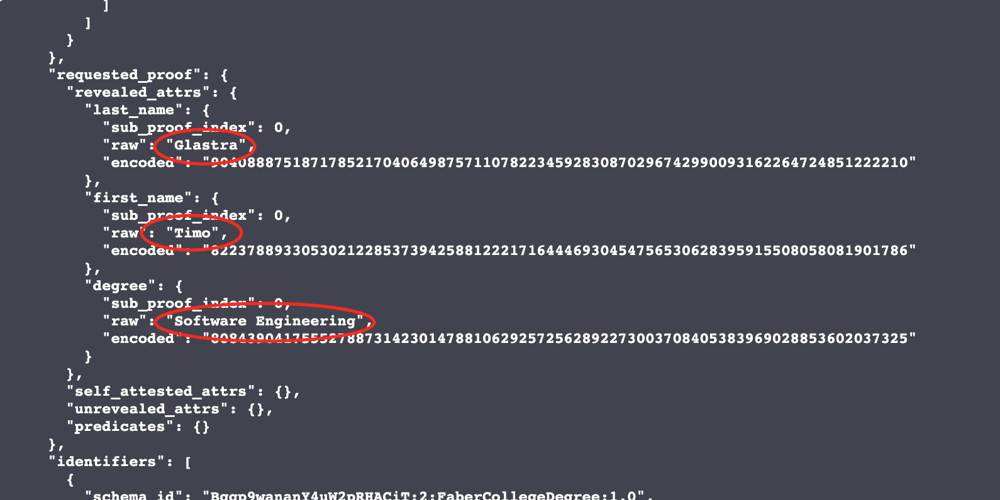

# Hyperledger Aries Workshop

> TODO: add workshop description

## Setup

### Download Wallet

You've got choice in the wallet you want to use. That's the awesomeness of Aries interoperability. All are [Aries Framework .NET](https://github.com/hyperledger/aries-framework-dotnet) and is free to use. The screenshots in this tutorial are from the the Trinsic wallet, but you can use any of them.

### Esatus Wallet


[](https://apps.apple.com/nl/app/esatus-wallet/id1496769057?l=en)
[](https://play.google.com/store/apps/details?id=com.esatus.wallet)

- [iOS](https://apps.apple.com/nl/app/esatus-wallet/id1496769057?l=en)
- [Android](https://play.google.com/store/apps/details?id=com.esatus.wallet)

#### Trinsic Wallet


[](https://apps.apple.com/us/app/trinsic-wallet/id1475160728)
[](https://play.google.com/store/apps/details?id=id.streetcred.apps.mobile)

- [iOS](https://apps.apple.com/us/app/trinsic-wallet/id1475160728)
- [Android](https://play.google.com/store/apps/details?id=id.streetcred.apps.mobile)

#### Lissi Wallet


[](https://apps.apple.com/us/app/lissi/id1501321092)
[](https://play.google.com/store/apps/details?id=io.lissi.mobile)

- [iOS](https://apps.apple.com/us/app/lissi/id1501321092)
- [Android](https://play.google.com/store/apps/details?id=io.lissi.mobile)

### Add Ledger to App

#### Download `genesis.txt`

By default the esatus Wallet is connected to the Sovrin Mainnet. To write to the Sovrin ledger we would need to pay, so for the demo and workshop we have already set up our own Hyperledger Indy network.

To connect to our ledger, we need to import the genesis file of our ledger. The genesis file contains all the information needed to connect to our ledger from within the esatus Wallet. Download the `genesis.txt` file to your phone. We are going to import this file into the esatus Wallet.

https://transfer.sh/SxPOL/genesis.txt


#### Import `genesis.txt` in esatus Wallet

In the esatus Wallet app go to the `Credentials` or `Connections` tab and click on the settings icon in the upper right corner. Under `Security` choose `Change Ledger`. In the upper right corner click on the `+` icon, click on `Select Genesis` and select the `genesis.txt` file you just saved. Give the ledger a name. (i.e. `Aries Workshop`) and click `Create Ledger`. You are now connected to our ledger and good to go.


## Faber & ACME Demo

During our presentation we showed you a demo where Faber issues a college degree to Alice. Alice then uses this college degree to apply for a job at ACME. Let's do this demo ourselves. We already have the esatus Wallet, so we can directly start by getting our college degree as a verifiable credential from Faber.

### Get college degree credential from Faber

Go to https://demo.blockchainlandscape.com/faber and click `Login` in the upper right corner. Fill in the email address (`firstname.lastname@student.faber.com`, e.g. `timo.glastra@student.faber.com`) and password (can be anything) and click `LOGIN`.

The site will now show a QR code that you can scan with the esatus Wallet. This is to setup a connection between Faber and you. Scan the QR with the esatus Wallet and click `Connect`. You now have a connection with Faber.

The Faber College website will now show you the content of the credential it wants to issue to you. It should contain your first name, last name and degree. First and last name are taken from your email, your degree will always be `SSI Guru`. In the bottom right corner click on `SEND`. In the esatus Wallet you should get a message that says you have a new credential offer from Faber. Click on `View` and then `Accept`. You will probably also get a popup asking if you want to auto accept credentials from Faber. Choose as you wish. If you now go to the `Credentials` tab in the esatus Wallet you should have your first Credential!


### Proof college degree credential to ACME

Now that we have our digital credential from Faber, we are going to prove we have a degree to ACME.

Go to https://demo.blockchainlandscape.com/acme and click `APPLY NOW`. The site will show a QR code that you can scan with the esatus Wallet. This is, again, to setup a connection. But now between you and ACME. Scan the QR with the esatus Wallet and click `Connect` You now have a connection with ACME.

Directly after connecting ACME will send you a proof request in the esatus Wallet. Click on `View Request` and `Send`. The ACME website should now show a big green checkmark and show the values of your credentials. This means that ACME received and verified your credential. In this demo, ACME has a requirement that only credentials issued by Faber are allowed. If you were to issue this credential to yourself, it won't work.


## Setup own infrastructure

Now that we've done the demo, lets recreate the steps it take to achieve the actions of Faber and ACME. To do this we need two Cloud Agents, one for Faber and one for ACME. The third agent for you as a holder is the esatus Wallet.

To setup our own infrastructure we need to have Docker and Docker Compose installed. The installation steps differ for each platform, so follow the instructions here: https://docs.docker.com/compose/install/

We also need Git to clone this repository. If you don't have Git, you can download it here: https://git-scm.com/

If both Git and Docker are installed we can launch our own instance of Aries Cloud Agent Python. The `docker-compose.yml` file contains the setup for two Cloud Agents (`faber-aca-py` & `acme-aca-py`). It also registers the DIDs of both Faber and ACME on the ledger (`faber-register-seed` & `acme-register-seed`). You can't issue credentials without registering your DID on the ledger. Because we are going to communicate with other people / servers we need to be reachable from the outside. The server is only running on our laptop, to make our server reachable from the outside world an [ngrok](https://ngrok.com/) tunnel is created (`faber-aca-py-tunnel-http` & `acme-aca-py-tunnel-http`).

So clone the repo and start the servers with docker compose:

```bash
git clone https://github.com/utrecht-dev/hyperledger-aries-workshop
cd hyperledger-aries-workshop

docker-compose up
```

> On Windows be sure to use Powershell, not Git Bash

A SwaggerUI instance will be started for both Faber (http://localhost:7002) and ACME (http://localhost:6002). This shows all the endpoints that are exposed by the Cloud Agent. We can also directly make calls to the Cloud Agent from within the SwaggerUI

## Replace Faber

Let's start by replacing the Faber website and do the required actions ourselves in the SwaggerUI of Faber.

There are four steps involved in getting the credential in the esatus Wallet:

1. Create Connection with Faber
2. Create Schema
3. Create Credential Definition
4. Issue the credential

### Create Connection with Faber

In the demo you scan a QR code to make a connection. To achieve this we need to create an invitation and create a QR from this. The Cloud Agent exposes an API endpoint to create an invitation. In the SwaggerUI go to the `connection` tab an click on `/connections/create-invitation`. You can also go there via this link: http://localhost:7002/api/doc#/connection/post_connections_create_invitation

In there click `Try it out`. Then in the `accept` field type `auto`. This will automate the creation of the connection after we made the invitation. Now click `Execute`. Scroll down to see a response containing the invitation. It should look something like this:

```json
{
  "connection_id": "d3b8712b-713e-4fd9-9aa3-c051ca4b97e9",
  "invitation": {
    "@type": "did:sov:BzCbsNYhMrjHiqZDTUASHg;spec/connections/1.0/invitation",
    "@id": "55e81868-328e-4c95-b44f-f3bf9e9b4838",
    "label": "Workshop Faber Agent",
    "serviceEndpoint": "https://d739ef5a.eu.ngrok.io",
    "recipientKeys": ["2EifHNx7j8dJYv6w1wdKhbG7jRnMAcynWudwycHnZdL6"]
  },
  "invitation_url": "https://d739ef5a.eu.ngrok.io?c_i=eyJAdHlwZSI6ICJkaWQ6c292OkJ6Q2JzTlloTXJqSGlxWkRUVUFTSGc7c3BlYy9jb25uZWN0aW9ucy8xLjAvaW52aXRhdGlvbiIsICJAaWQiOiAiNTVlODE4NjgtMzI4ZS00Yzk1LWI0NGYtZjNiZjllOWI0ODM4IiwgImxhYmVsIjogIldvcmtzaG9wIEZhYmVyIEFnZW50IiwgInNlcnZpY2VFbmRwb2ludCI6ICJodHRwczovL2Q3MzllZjVhLmV1Lm5ncm9rLmlvIiwgInJlY2lwaWVudEtleXMiOiBbIjJFaWZITng3ajhkSll2Nncxd2RLaGJHN2pSbk1BY3luV3Vkd3ljSG5aZEw2Il19"
}
```

Copy the `connection_id` value someplace, we are going to need this to issue the credential to the esatus Wallet. Now we need to generate a QR from the `invitation_url` parameter. Copy the `invitation_url` parameter to this site: https://www.webtoolkitonline.com/qrcode-generator.html, scan the QR with the esatus Wallet and accept the connection. Step 1 done!

### Create Schema

Now we are going to create a schema. Schemas define the attributes of a credential and are written to the legder. Try out the `schema` POST `/schemas/` (http://localhost:7002/api/doc#/schema/post_schemas) and in the `body` field paste the JSON object below. This contains the three attributes: `first_name`, `last_name`, `degree`.

```json
{
  "schema_version": "1.0",
  "schema_name": "FaberCollegeDegree",
  "attributes": ["first_name", "last_name", "degree"]
}
```

The response will look something like this:

```json
{
  "schema_id": "Bqqp9wananY4uW2pRHACiT:2:FaberCollegeDegree:1.0"
}
```

Copy the `schema_id` value from the response someplace, we need it in the next step.

### Create Credential Definition

A Credential Definition links a Schema (`FaberCollegeDegree`) to a specific issuer (`Faber`). Credential Definitions are also written to the ledger and needed for Zero Knowledge Proofs.

Try out the `credential-definition` POST `/credential-definitions` (http://localhost:7002/api/doc#/credential-definition/post_credential_definitions) and in the `body` field paste the JSON object below. Be sure to replace the `schema_id` value with the `schema_id` value from the previous step. It is possible the `schema_id` is the same as below, don't worry about that.

```json
{
  "schema_id": "Bqqp9wananY4uW2pRHACiT:2:FaberCollegeDegree:1.0",
  "tag": "FaberCollegeDegree"
}
```

The response, which can take a while, will look something like this:

```json
{
  "credential_definition_id": "Bqqp9wananY4uW2pRHACiT:3:CL:12:FaberCollegeDegree"
}
```

Copy the `credential_definition_id` value from the response someplace, we need it in the next step.

### Issue Credential

Finally we are going to issue the credential to the connection (esatus Wallet) we created in the first step. Try out the `issue-credential` POST `​/issue-credential​/send` (http://localhost:7002/api/doc#/issue-credential/post_issue_credential_send) and in the `body` field paste the JSON object below.

Be sure the replace the following values:

- `connection_id`: `connection_id` value from first step
- `cred_def_id`: `credential_definition_id` value from previous step
- `attributes.value`: You can change the values of `first_name`, `last_name` and `degree` to anything you like. Make sure to use something different than during the demo. This will make it easier to distinguish the credential in the wallet in the next steps.

```json
{
  "connection_id": "d3b8712b-713e-4fd9-9aa3-c051ca4b97e9",
  "cred_def_id": "Bqqp9wananY4uW2pRHACiT:3:CL:12:FaberCollegeDegree",
  "credential_proposal": {
    "@type": "did:sov:BzCbsNYhMrjHiqZDTUASHg;spec/issue-credential/1.0/credential-preview",
    "attributes": [
      {
        "name": "first_name",
        "value": "Kees"
      },
      {
        "name": "last_name",
        "value": "Bottema"
      },
      {
        "name": "degree",
        "value": "Teacher"
      }
    ]
  }
}
```

After executing the API call, check your esatus Wallet and wait for a Credential Offer to appear (or look for a notification). View and Accept the offer. We now completely reconstructed the steps from the Faber demo. Let's test it by using our credential in the ACME demo.

### Test it with ACME Demo

Follow the ACME demo again (https://demo.blockchainlandscape.com/acme). Because we now have two credentials that contain our name and degree, we can choose which one to share. If the latest is not selected automatically you can change it by pressing on the current value (see picture below).



## Replace ACME

### Create Connection with ACME

When applying for a job at ACME we also created a connection. Again, create an invitation, set the `accept` field to `auto`, copy the `connection_id` from the response somewhere, and create a QR from the `invitation_url`.

http://localhost:6002/api/doc#/connection/post_connections_create_invitation

response:

```json
{
  "connection_id": "3dd081cd-9dd3-45d5-a50b-acf618016232",
  "invitation": {
    "@type": "did:sov:BzCbsNYhMrjHiqZDTUASHg;spec/connections/1.0/invitation",
    "@id": "806de82c-0432-4c3f-85e6-322b74019289",
    "serviceEndpoint": "https://c59ed6b5.eu.ngrok.io",
    "recipientKeys": ["6UvLaUkR16nQLk8ej7M7cpapHHE81w9ZbArmELK6ykcS"],
    "label": "Workshop Acme Agent"
  },
  "invitation_url": "https://c59ed6b5.eu.ngrok.io?c_i=eyJAdHlwZSI6ICJkaWQ6c292OkJ6Q2JzTlloTXJqSGlxWkRUVUFTSGc7c3BlYy9jb25uZWN0aW9ucy8xLjAvaW52aXRhdGlvbiIsICJAaWQiOiAiODA2ZGU4MmMtMDQzMi00YzNmLTg1ZTYtMzIyYjc0MDE5Mjg5IiwgInNlcnZpY2VFbmRwb2ludCI6ICJodHRwczovL2M1OWVkNmI1LmV1Lm5ncm9rLmlvIiwgInJlY2lwaWVudEtleXMiOiBbIjZVdkxhVWtSMTZuUUxrOGVqN003Y3BhcEhIRTgxdzlaYkFybUVMSzZ5a2NTIl0sICJsYWJlbCI6ICJXb3Jrc2hvcCBBY21lIEFnZW50In0="
}
```

### Request proof

Now we are going to request the proof of eduction from the connection we created between our ACME server and the esatus Wallet. Try out the `present-proof` POST `​/present-proof/send-request` (http://localhost:6002/api/doc#/present-proof/post_present_proof_send_request) and in the `body` field paste the JSON object below.

Be sure the replace the following values:

- `connection_id`: `connection_id` value from previous step
- `cred_def_id`:`credential_definition_id` value from the credential definition you created with Faber. (All 3, first_name, last_name, degree)

Presentatino Exchange ID: e86f3fef-bf1c-415d-b034-349de19fa852

```json
{
  "connection_id": "3dd081cd-9dd3-45d5-a50b-acf618016232",
  "proof_request": {
    "requested_attributes": {
      "first_name": {
        "name": "first_name",
        "restrictions": [
          {
            "cred_def_id": "Bqqp9wananY4uW2pRHACiT:3:CL:12:FaberCollegeDegree"
          }
        ]
      },
      "last_name": {
        "name": "last_name",

        "restrictions": [
          {
            "cred_def_id": "Bqqp9wananY4uW2pRHACiT:3:CL:12:FaberCollegeDegree"
          }
        ]
      },
      "degree": {
        "name": "degree",
        "restrictions": [
          {
            "cred_def_id": "Bqqp9wananY4uW2pRHACiT:3:CL:12:FaberCollegeDegree"
          }
        ]
      }
    },
    "requested_predicates": {},
    "name": "AcmeRequestEsatusWallet",
    "version": "1.0",
    "nonce": "12345678"
  }
}
```

Copy the `presentation_exchange_id` value from the response somewhere before proceeding. The esatus Wallet will now show a proof request. Choose the values you want to share and click send. Your ACME server now has the proof of eduction credential, the last step is to verify the credential.

### Verify Proof

The last step is to verify the proof of education credential we received in the previous step. Try out the `present-proof` POST `​/present-proof/records/{pres_ex_id}/verify-presentation` (http://localhost:6002/api/doc#/present-proof/post_present_proof_records**pres_ex_id**verify_presentation) and in the `pres_ex_id` field paste the `presentation_exchange_id` value from the previous step.

The response is a very large JSON object containing all cryptographic proof values. You should check two things:

1. That the `state` field contains the value `verified`
2. That the raw values are the same as the values you shared from the esatus Wallet. (see picture below)



You now fully reconstructed the Faber and ACME demo, but without the graphical interface. Congratz!
